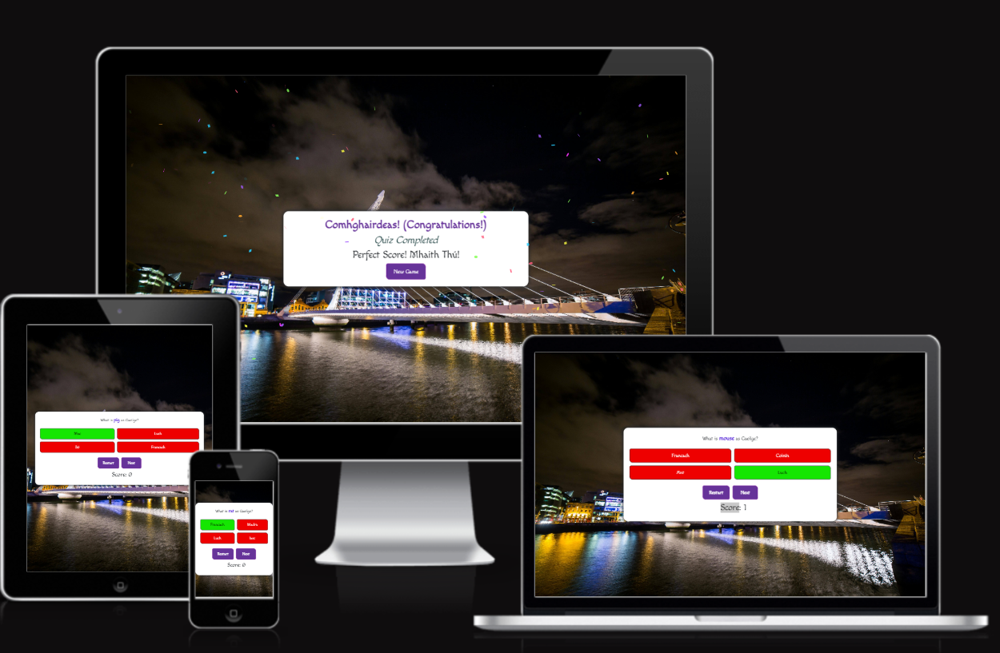
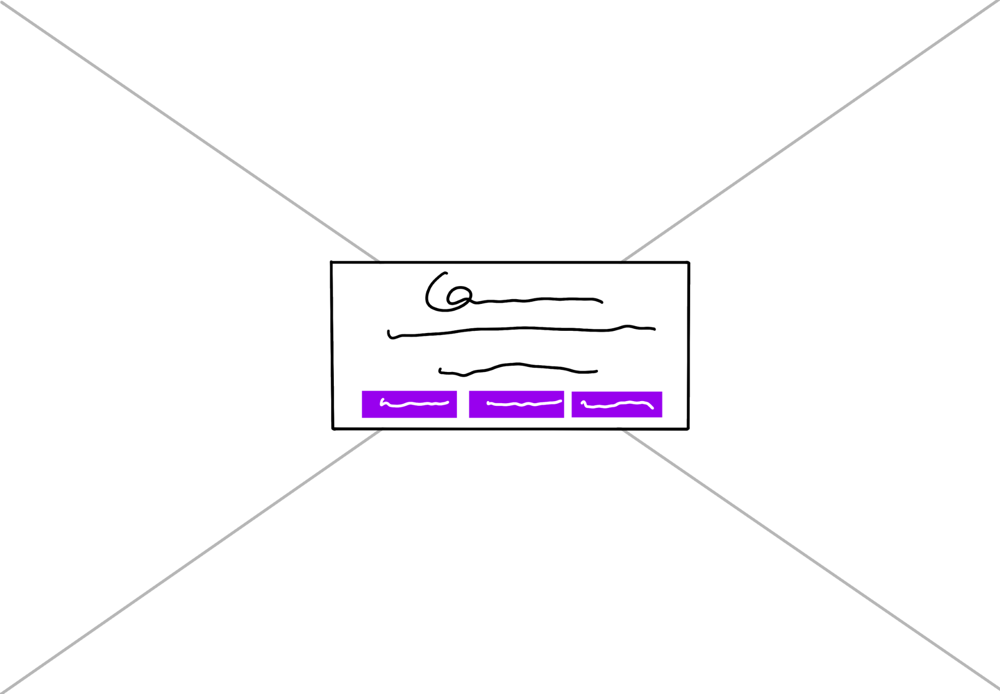
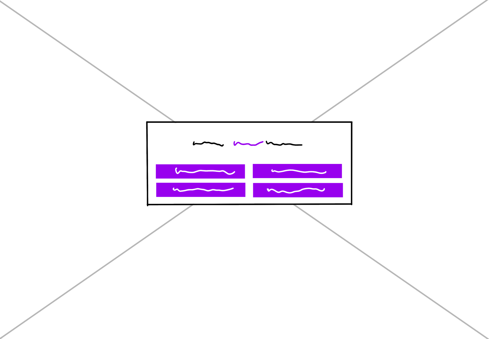
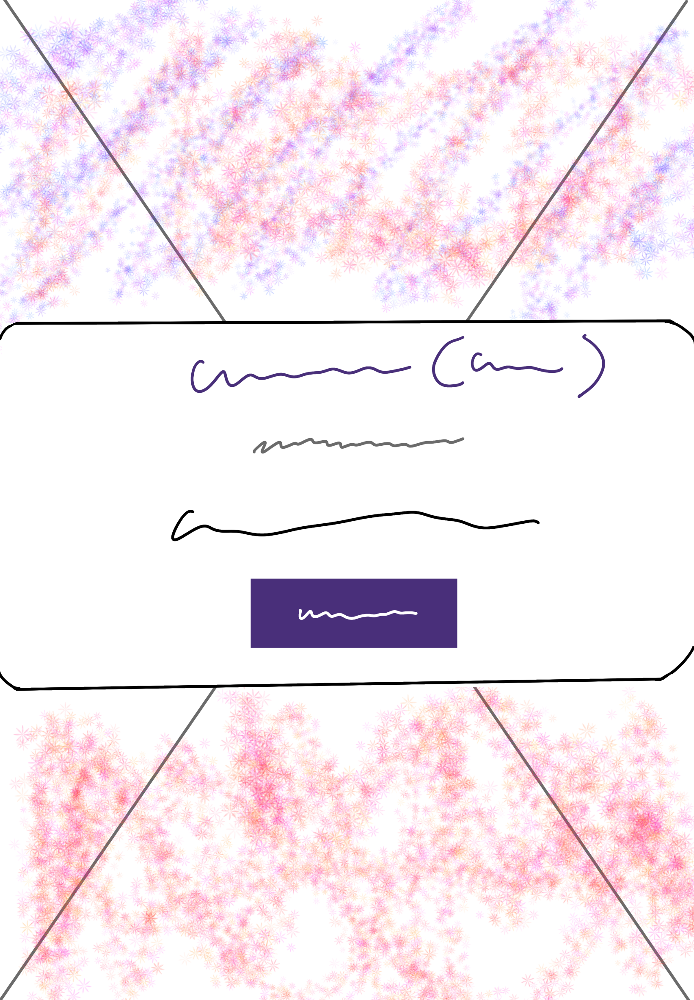
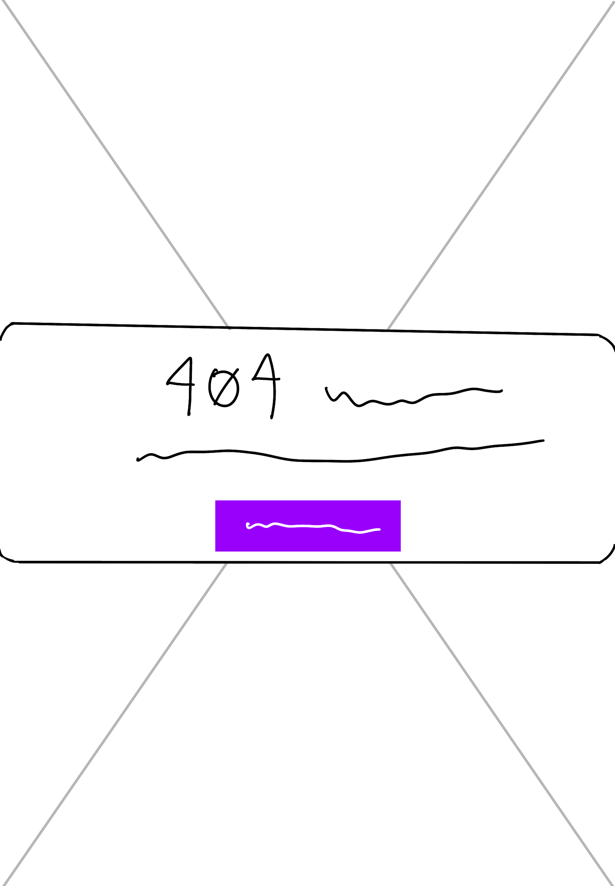
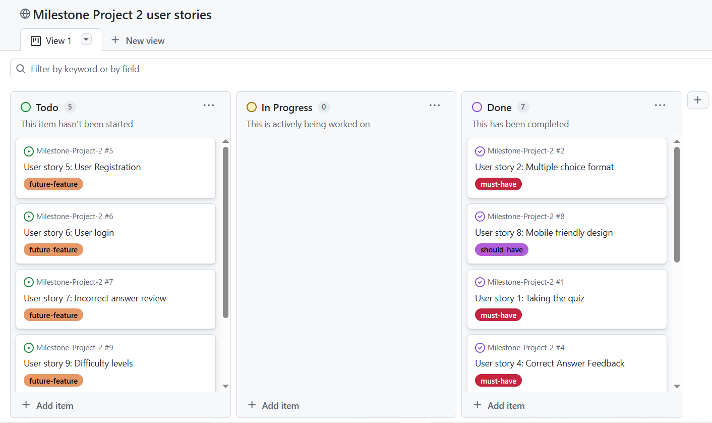
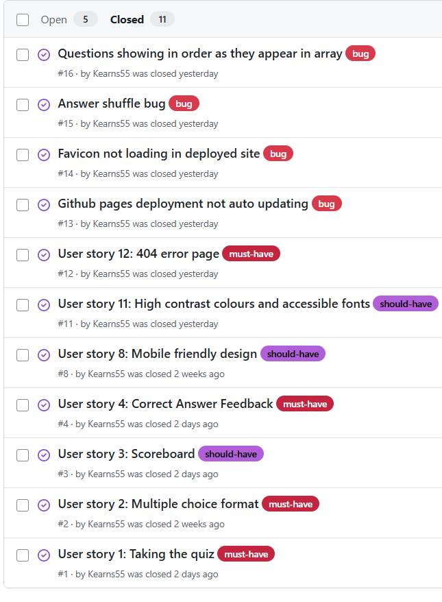

# [Milestone-Project-2](https://kearns55.github.io/Milestone-Project-2)

Developer: Rebekah Kearns ([Kearns55](https://www.github.com/Kearns55))

## Overview:
*Quiz as Gaeilge is a browser-based Irish language quiz built mostly using Javascript. The purpose of this project is to enable users to test and enhance their Irish knowledge, most of which they haven't used since school! Due to the recent revival of interest in the Irish language, I have developed a passion to make it accessible for all ages to reignite their own passion to learn our national language. Learning Irish is extremely important to me and I hope to make more projects in the future to help people find their own interest in it. This is just the start of a new wave of learning Irish, I hope!*

**Site Mockups**

source: [Milestone-Project-2 amiresponsive](https://ui.dev/amiresponsive?url=https://kearns55.github.io/Milestone-Project-2)

## UX

### The 5 Planes of UX

#### 1. Strategy

**Purpose**
- Provide users with a simple and accessible way to practice Irish.
- Deliver instant feedback to improve usability and encourage learning.
- Support accessibility and user-friendly interactions.

**Primary User Needs**
- Interactive and fun learning experience.
- Understand incorrect answers and have the correct answer shown instantly.
- Track performance to motivate self-improvement.
- Ease of use, users expect a straightforward, beginner-friendly interface (clear category selection, simple multiple-choice layout, no setup required).
- Replay-ability, users may want to try again, choose new categories, or restart to reinforce knowledge.

**Business Goals**
- Encourage users to engage with the app for educational and recreational purposes.
- Showcase a well-designed, accessible tool that supports learning.

#### 2. Scope

**[Features](#features)** (see below)

**Content Requirements**
- Category-based quizzes in Animals, Fruits, and Colours.
- Multiple-choice questions with only one correct answer.
- Instant answer-checking.
- Score tracking throughout the quiz.
- Feedback on completion, including a congratulatory message and final score.
- Option to restart the quiz or select a new category.
- Runs entirely in the browser, no download required.

#### 3. Structure

**Information Architecture**
 **Home Screen**:
- Home screen welcoming the user to the quiz page feauturing the name Quiz as Gaeilge, category selection buttons and instructions for use of them. 

**Hierarchy**:
- Clear and prominent placement of the question text at the top of the quiz screen.
- Answer buttons positioned directly below the question, all equal in size for easy selection. 
- Immediate visual feedback through button colour change: Green for a correct answer and red for incorrect.
- Score counter consistently displayed below answer buttons, total score counter shown at the end of the quiz.
- Navigation button (“Next” and “Restart”) placed clearly below the answers.

**User Flow**
1. User lands on the home page → reads brief instructions.
2. Selects category → starts a quiz based on category selected.
3. Presented with a multiple choice question.
4. Views correct/incorrect visual colour coded feedback.
5. Proceeds to next question or uses the restart button to return to homepage and select a new category.

#### 4. Skeleton

**[Wireframes](#wireframes)** (see below)

#### 5. Surface

**Visual Design Elements**
- **[Colours](#colour-scheme)** (see below)
- **[Typography](#typography)** (see below)

### Colour Scheme

I used [coolors.co](https://coolors.co/2f4f4f-ffffff-000000-663399) to generate my colour palette.

- `#000000` primary text.
- `#ffffff` primary highlights.
- `#2f4f4f` secondary text.
- `#663399` secondary highlights.

### Typography

- [Macondo](https://fonts.google.com/specimen/Macondo) was the only font used across the site.

## Wireframes

To follow best practice, wireframes were developed for mobile and desktop sizes.
I've used [Procreate](https://procreate.com/) to design my site wireframes.

| Page | Mobile | Desktop |
| --- | --- | --- |
| Home |  |  |
| Quiz |  |  |
| End Screen |  |  |
| 404 |  |  |

## User Stories

| Target | Expectation | Outcome |
| --- | --- | --- |
| As a learner | I want to take a quiz that tests my Irish-to-English vocabulary | so that I can practice speaking Irish everyday. | 
| As a quiz taker |  I want the questions to be multiple choice |  so that I can easily select an answer without typing. | 
| As a learner | I want to see my score at the end of the quiz| so that I can track how well I did. | 
| As a user | I want to know immediately whether my answer is correct or incorrect | so that I can learn from my mistakes right away. |
| As a user | I want the application to have high-contrast colours and accessible fonts | so that I can easily read and interact with it. |
| As a mobile user | I want the website to work well on my phone | so that I can take quizzes on the go. | 
| As a user | I would like to see a 404 error page if I get lost | so that it's obvious that I've stumbled upon a page that doesn't exist. | 

## Features

### Existing Features

| Feature | Notes | Screenshot |
| --- | --- | --- |
| Category Selection | The home page of the quiz features bold eye-catching category selection buttons.  |  |
| Answer Buttons | The answer buttons feature a colour coded  grading function, changing from purple to green for a correct answer or red for incorrect.  | |
| Final Score | This section tallies the total number of *correct* answers that the user has. |  |
| 404 | The 404 error page will indicate when a user has somehow navigated to a page that doesn't exist. This replaces the default GitHub Pages 404 page, and ties-in with the look and feel of  *Quiz as Gaeilge*. |  |

### Future Features

- **Daily Challenge**: Add a daily challenge that refreshes every 24 hours and features seasonal themes (e.g., Christmas).
- **Difficulty Levels**: Add varying difficulty levels for more advanced learning.
- **Incorrect Answer Review**: At the end of the quiz I want to add an incorrect answer review so that users can see which words they got incorrect, improving their language skills.
- **User Login**: Integrate a user database so returning users can pick up where they left off and save scores from previous quizzes.
- **User Registration**: Feeding off the last future feature, add the means to create logins for users using email and passwords.

## Tools & Technologies

| Tool / Tech | Use |
| --- | --- |
|  | Generate README and TESTING templates. |
|  | Version control. (`git add`, `git commit`, `git push`) |
|  | Secure online code storage. |
|  | Local IDE for development. |
|  | Main site content and layout. |
|  | Design and layout. |
|  | User interaction on the site. |
|  | Hosting the deployed front-end site. |
|  | Front-end CSS framework for modern responsiveness and pre-built components. |
|  | Help debug, troubleshoot, and explain things. |
|  | Troubleshooting and Debugging |

## Agile Development Process

### GitHub Projects

[GitHub Projects](https://www.github.com/Kearns55/Milestone-Project-2/projects) served as an Agile tool for this project. Through it, EPICs, User Stories, issues/bugs, and Milestone tasks were planned, then subsequently tracked on a regular basis using the Kanban project board.

### GitHub Issues

[GitHub Issues](https://www.github.com/Kearns55/Milestone-Project-2/issues) served as an another Agile tool. There, I managed my User Stories and Milestone tasks, and tracked any issues/bugs.

| Link | Screenshot |
| --- | --- |
|  |  |
|  |  |

### MoSCoW Prioritization

I've decomposed my Epics into User Stories for prioritizing and implementing them. Using this approach, I was able to apply "MoSCoW" prioritization and labels to my User Stories within the Issues tab.

- **Must Have**: guaranteed to be delivered - required to Pass the project (*max ~60% of stories*)
- **Should Have**: adds significant value, but not vital (*~20% of stories*)
- **Could Have**: has small impact if left out (*the rest ~20% of stories*)
- **Won't Have**: not a priority for this iteration - future features

## Testing

> [!NOTE]  
> For all testing, please refer to the [TESTING.md](TESTING.md) file.

## Deployment

### GitHub Pages

The site was deployed to GitHub Pages. The steps to deploy are as follows:

- In the [GitHub repository](https://www.github.com/Kearns55/Milestone-Project-2), navigate to the "Settings" tab.
- In Settings, click on the "Pages" link from the menu on the left.
- From the "Build and deployment" section, click the drop-down called "Branch", and select the **main** branch, then click "Save".
- The page will be automatically refreshed with a detailed message display to indicate the successful deployment.
- Allow up to 5 minutes for the site to fully deploy.

The live link can be found on [GitHub Pages](https://kearns55.github.io/Milestone-Project-2).

### Local Development

This project can be cloned or forked in order to make a local copy on your own system.

#### Cloning

You can clone the repository by following these steps:

1. Go to the [GitHub repository](https://www.github.com/Kearns55/Milestone-Project-2).
2. Locate and click on the green "Code" button at the very top, above the commits and files.
3. Select whether you prefer to clone using "HTTPS", "SSH", or "GitHub CLI", and click the "copy" button to copy the URL to your clipboard.
4. Open "Git Bash" or "Terminal".
5. Change the current working directory to the location where you want the cloned directory.
6. In your IDE Terminal, type the following command to clone the repository:
	- `git clone https://www.github.com/Kearns55/Milestone-Project-2.git`
7. Press "Enter" to create your local clone.

Alternatively, if using Gitpod, you can click below to create your own workspace using this repository.

**Please Note**: in order to directly open the project in Gitpod, you should have the browser extension installed. A tutorial on how to do that can be found [here](https://www.gitpod.io/docs/configure/user-settings/browser-extension).

#### Forking

By forking the GitHub Repository, you make a copy of the original repository on our GitHub account to view and/or make changes without affecting the original owner's repository. You can fork this repository by using the following steps:

1. Log in to GitHub and locate the [GitHub Repository](https://www.github.com/Kearns55/Milestone-Project-2).
2. At the top of the Repository, just below the "Settings" button on the menu, locate and click the "Fork" Button.
3. Once clicked, you should now have a copy of the original repository in your own GitHub account!

### Local VS Deployment

There are no remaining major differences between the local version when compared to the deployed version online.

## Credits

### Content

| Source | Notes |
| --- | --- |
| [Markdown Builder](https://markdown.2bn.dev) | Help generating Markdown files |
| [Chris Beams](https://chris.beams.io/posts/git-commit) | "How to Write a Git Commit Message" |
| [Interactive Frontend Development](https://codeinstitute.net) | Code Institute walkthrough project inspiration |
| [WebDevSimplified](https://www.youtube.com/watch?v=riDzcEQbX6k) | Inspiration for a quiz app |
| [WebDevSimplified](https://www.youtube.com/watch?v=1yS-JV4fWqY) | Inspiration for Rock Paper Scissors |
| [JavaScript30](https://javascript30.com) | Additional JS help |
| [Bootstrap](https://getbootstrap.com) | Various components / responsive front-end framework |
| [ChatGPT](https://chatgpt.com) | Help with code logic and explanations |

### Media

⚠️ INSTRUCTIONS ⚠️

Use this space to provide attribution links to any media files borrowed from elsewhere (images, videos, audio, etc.). If you're the owner (or a close acquaintance) of some/all media files, then make sure to specify this information. Let the assessors know that you have explicit rights to use the media files within your project. Ideally, you should provide an actual link to every media file used, not just a generic link to the main site, unless it's AI-generated artwork.

Looking for some media files? Here are some popular sites to use. The list of examples below is by no means exhaustive.

- Images
    - [Pexels](https://www.pexels.com)
    - [Unsplash](https://unsplash.com)
    - [Pixabay](https://pixabay.com)
    - [Lorem Picsum](https://picsum.photos) (placeholder images)
    - [Wallhere](https://wallhere.com) (wallpaper / backgrounds)
    - [This Person Does Not Exist](https://thispersondoesnotexist.com) (reload to get a new person)
- Audio
    - [Audio Micro](https://www.audiomicro.com/free-sound-effects)
    - [Button Clicks](https://www.zapsplat.com/sound-effect-category/button-clicks)
    - [Lasers & Weapons](https://www.zapsplat.com/sound-effect-category/lasers-and-weapons/page/5)
    - [Puzzle Music](https://soundimage.org/puzzle-music)
    - [Camtasia Audio](https://library.techsmith.com/camtasia/assets/Audio)
- Video
    - [Videvo](https://www.videvo.net)
- Image Compression
    - [TinyPNG](https://tinypng.com) (for images <5MB)
    - [CompressPNG](https://compresspng.com) (for images >5MB)

A few examples have been provided below to give you some ideas on how to do your own Media credits.

⚠️ --- END ---⚠️

| Source | Notes |
| --- | --- |
| [favicon.io](https://favicon.io) | Generating the favicon |
| [Font Awesome](https://fontawesome.com) | Icons used throughout the site |
| [Pexels](https://images.pexels.com/photos/416160/pexels-photo-416160.jpeg) | Hero image |
| [Wallhere](https://c.wallhere.com/images/9c/c8/da4b4009f070c8e1dfee43d25f99-2318808.jpg!d) | Background wallpaper |
| [Pixabay](https://cdn.pixabay.com/photo/2017/09/04/16/58/passport-2714675_1280.jpg) | Background wallpaper |
| [Mixkit](https://mixkit.co/free-sound-effects/game) | Royalty-free sound effects for the game |
| [DALL-E 3](https://openai.com/index/dall-e-3) | AI generated artwork |
| [TinyPNG](https://tinypng.com) | Compressing images < 5MB |
| [CompressPNG](https://compresspng.com) | Compressing images > 5MB |
| [CloudConvert](https://cloudconvert.com/webp-converter) | Converting images to `.webp` |

### Acknowledgements

⚠️ INSTRUCTIONS ⚠️

Use this space to provide attribution and acknowledgement to any supports that helped, encouraged, or supported you throughout the development stages of this project. It's always lovely to appreciate those that help us grow and improve our developer skills. A few examples have been provided below to give you some ideas.

⚠️ --- END ---⚠️

- I would like to thank my Code Institute mentor, [Tim Nelson](https://www.github.com/TravelTimN) for the support throughout the development of this project.
- I would like to thank the [Code Institute](https://codeinstitute.net) Tutor Team for their assistance with troubleshooting and debugging some project issues.
- I would like to thank the [Code Institute Slack community](https://code-institute-room.slack.com) for the moral support; it kept me going during periods of self doubt and impostor syndrome.
- I would like to thank my partner, for believing in me, and allowing me to make this transition into software development.
- I would like to thank my employer, for supporting me in my career development change towards becoming a software developer.

