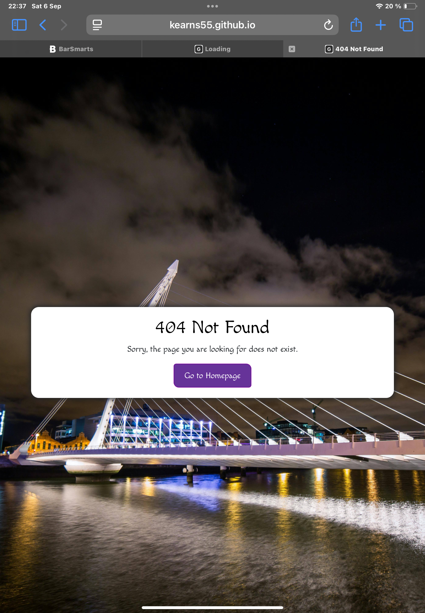

# Testing

> [!NOTE]  
> Return back to the [README.md](README.md) file.

## Code Validation

I have used the recommended [HTML W3C Validator](https://validator.w3.org) to validate all of my HTML files.

| Directory | File | URL | Screenshot | 
| --- | --- | --- | --- | 
|  | [404.html](https://github.com/Kearns55/Milestone-Project-2/blob/main/404.html) | [HTML Validator](https://validator.w3.org/nu/?doc=https://kearns55.github.io/Milestone-Project-2/404.html) |  |
|  | [index.html](https://github.com/Kearns55/Milestone-Project-2/blob/main/index.html) | [HTML Validator](https://validator.w3.org/nu/?doc=https://kearns55.github.io/Milestone-Project-2/index.html) |  |

### CSS

I have used the recommended [CSS Jigsaw Validator](https://jigsaw.w3.org/css-validator) to validate all of my CSS files.

| Directory | File | URL | Screenshot | 
| --- | --- | --- | --- |
| assets | [style.css](https://github.com/Kearns55/Milestone-Project-2/blob/main/assets/css/style.css) | [CSS Validator](https://jigsaw.w3.org/css-validator/validator?uri=https://kearns55.github.io/Milestone-Project-2) |  |

### JavaScript

I have used the recommended [JShint Validator](https://jshint.com) to validate all of my JS files.

| Directory | File | URL | Screenshot | 
| --- | --- | --- | --- | 
| assets | [questions.js](https://github.com/Kearns55/Milestone-Project-2/blob/main/assets/js/questions.js) |  |  |
| assets | [script.js](https://github.com/Kearns55/Milestone-Project-2/blob/main/assets/js/script.js) |  |  |

## Responsiveness

I've tested my deployed project to check for responsiveness issues.

| Page | Mobile | Tablet | Desktop | 
| --- | --- | --- | --- | 
| Home |  |  |  | Works as expected |
| Game |  |  |  | Works as expected |
| 404 |  |  |  | Works as expected |

## Browser Compatibility

- [Chrome](https://www.google.com/chrome)
- [Safari](https://support.apple.com/downloads/safari)
- [Brave](https://brave.com/download)

I've tested my deployed project on multiple browsers to check for compatibility issues.

| Page | Chrome | Brave | Safari | 
| --- | --- | --- | --- | 
| Home |  |  |  | Works as expected |
| Game |  |  |  | Works as expected |
| 404 |  |  |  | Works as expected |

## Lighthouse Audit

I've tested my deployed project using the Lighthouse Audit tool to check for any major issues. Some warnings are outside of my control, and mobile results tend to be lower than desktop.

| Page | Mobile | Desktop |
| --- | --- | --- |
| Home |  |  |
| Game |  |  |
| 404 |  |  |

## Defensive Programming

Defensive programming was manually tested with the below user acceptance testing:

| Page/Feature | Expectation | Test | Result | Screenshot |
| --- | --- | --- | --- | --- |
| | Feature is expected to display buttons that are clear, large, and easy to select on all devices. | Verified button sizes and usability across multiple devices (mobile, tablet, desktop). | Buttons were accessible and easy to use on all tested devices. |  |
| | Feature is expected to use high-contrast colors and accessible fonts. | Checked contrast ratios using accessibility tools (e.g., Lighthouse, Wave). | Colors and fonts met accessibility standards. |  |
| | Feature is expected to have clear labels and instructions for user guidance. | Reviewed labels and instructions for clarity and ease of use. | Labels and instructions were clear and intuitive. |  |
| Answer checking | Feature is expected to change the colour of the option buttons corresponding to the answer selected : Green being a correct answer and red being incorrect | Tested both correct and incorrect answers. | Correct results were displayed for both tested cases. |  |
| Score Tracker | Feature is expected to track the number of correct and incorrect answers. |  Tested that the score tracker updates after correct answer is selected. | Score tracker updated correctly for all tested scenarios. |  |
| 404 Error Page | Feature is expected to display a 404 error page for non-existent pages. | Navigated to an invalid URL (e.g., `/404`) to test error handling. | A custom 404 error page was displayed as expected. |  |

## User Story Testing

| Target | Expectation | Outcome | Screenshot |
| --- | --- | --- | --- |
| As a learner | I want to take a quiz that tests my Irish-to-English vocabulary | so that I can practice speaking Irish everyday |  |
| As a quiz taker |  I want the questions to be multiple choice |  so that I can easily select an answer without typing. |  |
| As a learner | I want to see my score at the end of the quiz| so that I can track how well I did |  |
| As a user | I want to know immediately whether my answer is correct or incorrect | so that I can learn from my mistakes right away |  |
| As a user | I want the application to have high-contrast colors and accessible fonts | so that I can easily read and interact with it. |  |
| As a mobile user | I want the website to work well on my phone | so that I can take quizzes on the go. |  |
| As a user | I would like to see a 404 error page if I get lost | so that it's obvious that I've stumbled upon a page that doesn't exist. |  |

## Bugs

### Fixed Bugs

I've used [GitHub Issues](https://www.github.com/Kearns55/Milestone-Project-2/issues) to track and manage bugs and issues during the development stages of my project.

All previously closed/fixed bugs can be tracked [here](https://www.github.com/Kearns55/Milestone-Project-2/issues?q=is%3Aissue+is%3Aclosed+label%3Abug).

### Unfixed Bugs

Any remaining open issues can be tracked [here](https://www.github.com/Kearns55/Milestone-Project-2/issues?q=is%3Aissue+is%3Aopen+label%3Abug).

> [!IMPORTANT]  
> There are no remaining bugs that I am aware of, though, even after thorough testing, I cannot rule out the possibility.

